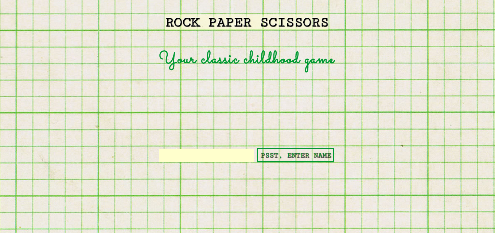
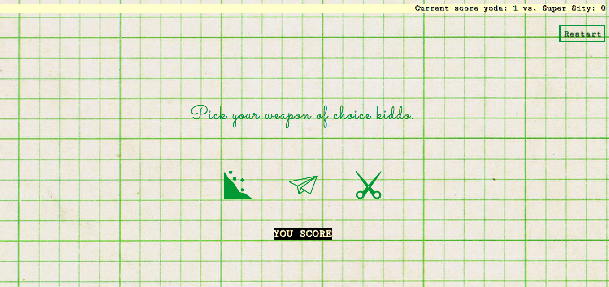

# Rock Paper Scissors

## Introduction

:punch: :wave: :v:

Welcome to Rock Paper Scissors! This is a little web app that allows you to play your classic childhood game.

## Instructions

### Clone this repo to your computer

```
$ git clone git@github.com:sitypop/rps.git
```

### Install the Java Development Kit (JDK)

Install the [JDK](http://www.oracle.com/technetwork/java/javase/downloads/index.html)

Check it's installed by typing:

```
$ java -version
```

You should see a version number.

### Install the other dependencies

```
$ cd path/to/rps/
$ npm install
$ bower install
$ npm run install-selenium-dependencies
```

### Run and play!
```
$ cd path/to/rps/
$ npm run start
```

Go to [http://localhost:8080](http://localhost:8080) in your web browser.

Enter your name/fake name/alter-ego/favorite Starts Wars character to start the game.



You'll then be invited to choose a weapon. Grr.



Let's see who wins...

## Testing

### Feature Tests

In a terminal, run your app.

```
$ cd path/to/rps/
$ npm run start
```

In a *second* terminal (with your app still running from the previous step), run Selenium.

```
$ cd path/to/news-summariser/
$ npm run start-selenium
```

In a *third* terminal (with your app and Selenium still running from the previous steps), run your feature tests.

```
$ cd path/to/rps/
$ npm run test-features
```

You should see lots of lovely little ✅✅✅

### Unit Tests

```
$ cd path/to/rps/
$ npm run test-units
```

Phew that's a lot of ✅✅✅

## Technologies Used
* HTML - *duh.*
* SASS - *because SASS makes CSS sexy.*
* BEM - *a methodology to achieve reusable components and code sharing in the front-end i.e. makes CSS sexy.*
* Angular - *a client side application framework to make my web app super speedy and responsive.*

## Weaknesses (Don't read this if you don't want to cheat)
* On completing a game, rather than clicking the restart button (like every good player would do) on the results page to restart a game, if you merely click back, the app will take you back to the game you were playing with the existing scores and one can continue scoring until infinity...
* If you decide to refresh the play page or result page, it is still possible to play, but your player name will be absent and both scores will be NAN.
* However, if you click restart after refreshing, it is possible to play as a no-name player. Naughty.

## Things I would like to improve
* Given more time I would want to integrate Webpack and Babel and make the it ES6.
* Add some interactive animation using 'ngAnimate' to the CSS. Particularly a little wiggle on the weapon icons when clicked.
* Make the CSS responsive.
